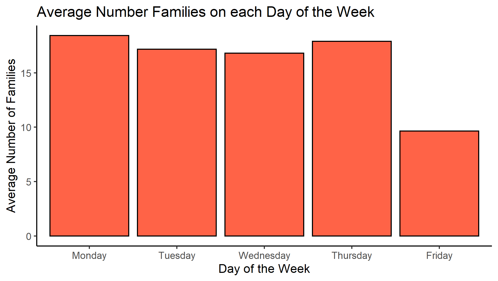
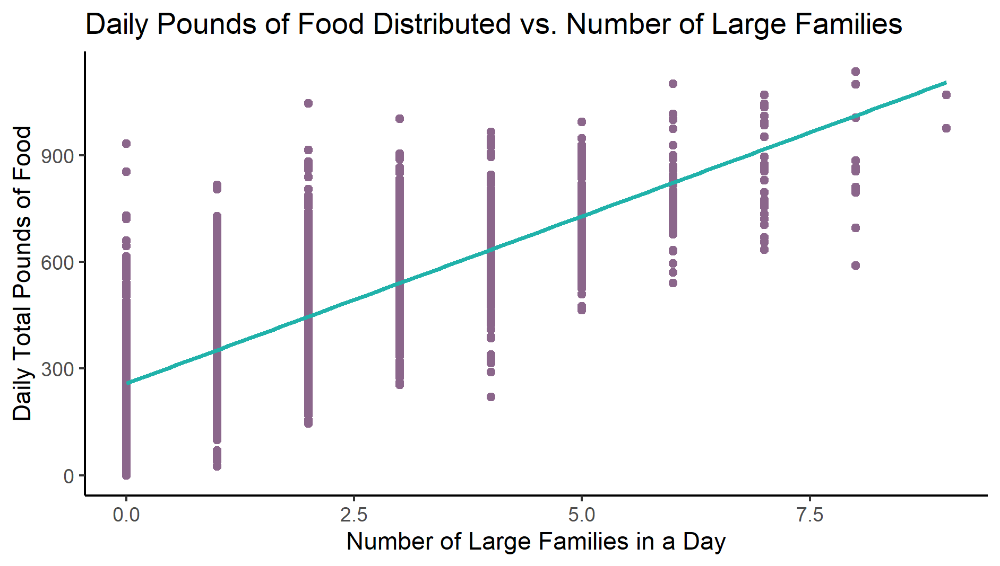
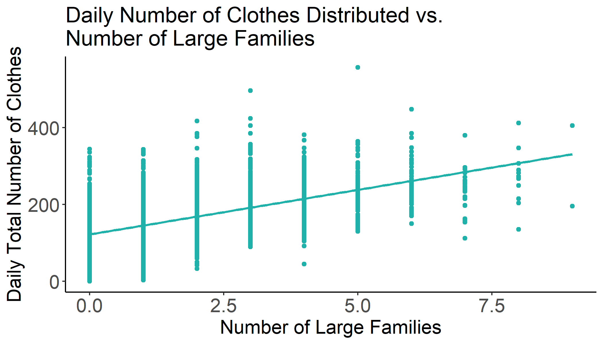
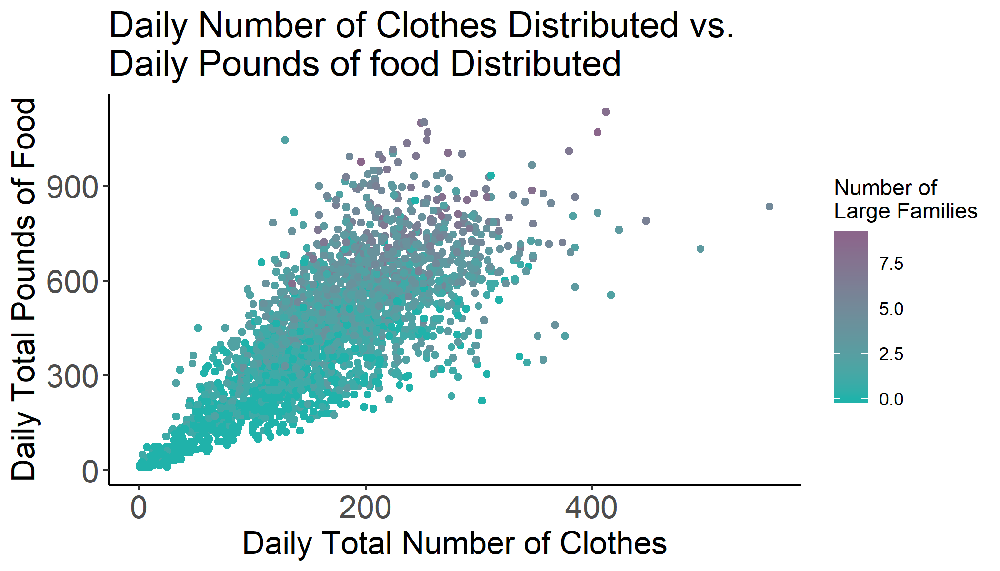
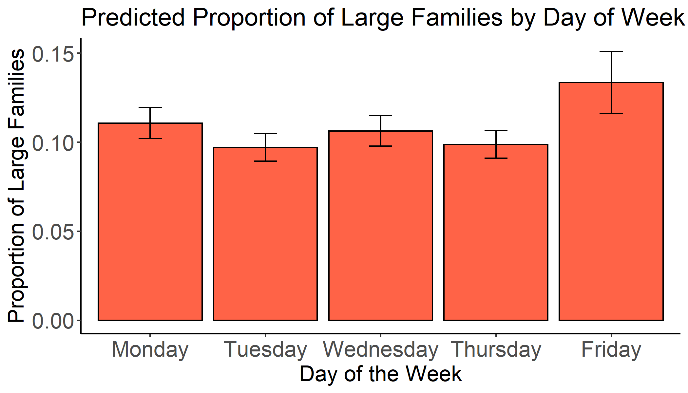

##### Created by: Amber Young

```{r echo=FALSE, results="hide"}
df <- data.frame(c("Pounds of Food", "Items of Clothing"), c(1665, 710), c(1595, 688), c(1737, 732))
colnames(df) <- c(" ", "Average", "Lower Bound", "Upper Bound")
```


## What is Urban Ministries?
Urban Ministries, established in 1983, offers many programs to help support homeless and low-income people in the Durham community. These programs include:

* A community shelter, which can accomodate over 140 people a night
* A community cafe, which offers breakfast, lunch, and dinner daily to the homeless
* A food pantry, that provides people with groceries, and
* A clothing closet, that supplies individuals and families with clothing each month.

All together this organization helps about 6,000 people per year with over 4,000 volunteers, and they rely heavily on donations of food and clothing from the community.

## What questions will this project address?
Some challenges an organization like this faces is knowing "how much" and "when".
Having answers to these two questions, can help them know when to collect donations, when to hold food/clothing drives, and even when they need to schedules volunteers.
Therefore, this project seeks to help Urban Ministries understand the trends in their food and clothing distribution by answering questions such as:

* How much food and clothing do they need in supply to make it through a week?
* How much food and clothing can Urban ministries expect to distribute on any given day of the week?
* When can they expect to serve larger families who naturally need more resources?

## Keeping up with the crowds
In an average week, Urban Ministries can expect to distribute about 1,665 pounds of food. In 95% of weeks they will distribute between 1,595 and 1,737 pounds of food. In other words, they will rarely distribute more that 1,717 lbs or less than 1,595 lbs.

Additionally, in a week they can expect to distribute about 710 items of clothing. In 95% of weeks they will distribute between 688 and 732 items.

The following table summarizes these results:

```{r echo=F}
library(knitr)
kable(df)
```

## The Friday phenomenon
Urban Ministries tends to distribute less food and clothes on Mondays, Wednesdays, and Fridays than on Tuesdays and Thursdays. This trend is actually consistent with their hours of operation. They are open for more hours on Tuesday and Thursday than the other days of the week. More surprising, is that they distribute less food and clothing on Fridays than any other day of the week. 

{width=45%}
{width=45%}


It turns out that, in general, less families visit Urban Ministries on Friday.


{width=45%}

One big question is: why? Why does Urban Ministries see less people and resource distribution on Fridays? Do they run out of resources by the end of the week? Do the have less volunteers on Friday? The rest of this report will attempt to explain the "Friday Phenomenon."


## Large families need more resources
Large families naturally need more of everything. Therefore, the amount of any product distributed is driven by the number of large families that visit that day. On a given day, the more large families that visit Urban Ministries, the more food or the clothing that will be distributed. We can easily see this in the following two graphs:

{width=45%}
{width=45%}

This next graph summarizes the relationship between all three variables, when there are more large families, there is more food and clothes distributed.

{width=45%}

## More large families on Fridays
Since there is such a correlation between the number of large families that visit in a given day and the amount a resources the shelter provides on that day, knowing what days of the week will see a higher proportion of large families is particulary useful for Urban Ministries. In the following graph, we can see that there is a higher proportion of large families coming in for services on Fridays. (A large family being defined as a group of more than 5 people).

{width=45%}

## Explanations and conclusions
In general, the tables and and graphs in this report can help Urban Ministries be better prepared for what to expect in a given week or on a given day.

Being that Friday is at the end of the week, it's possible that the food pantry and clothing closet tend to run out of items by Friday. This, in combination with the fact that there is usually a higher proportion of large families on this day, it is possible that the large families take up the limited resources available. This would cause Urban Ministries to not be able to provide services for as many families on Fridays.

While this is just one possible explanation of these trends, Urban Ministries should use their field knowledge to come to their own explanations. Answering this question could help them make better use of their Fridays, so that they can better serve the Durham community.


